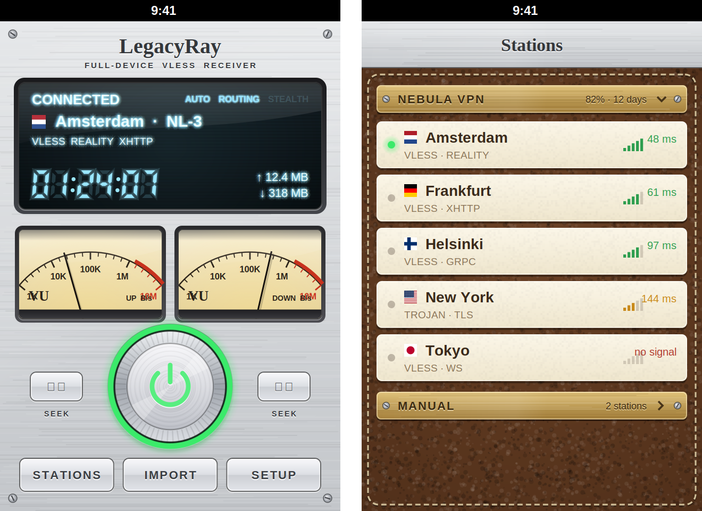
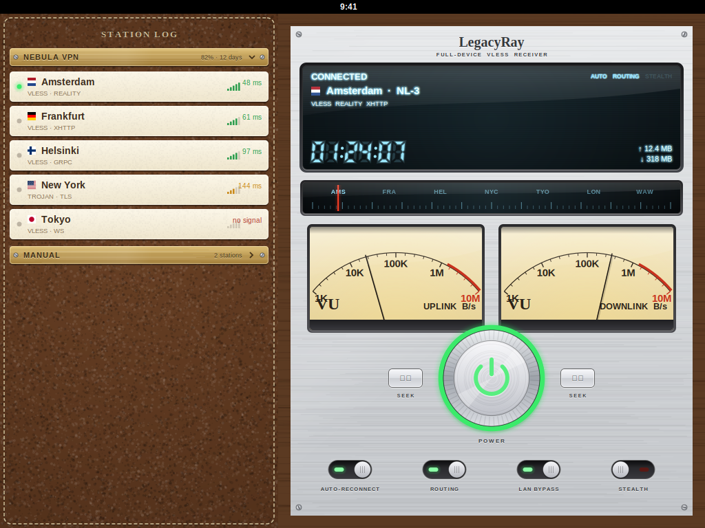

# LegacyRay

Клиент VLESS / Trojan / Shadowsocks / SOCKS / AmneziaWG для всего устройства на
**iOS 4.0 – 7.x** (джейлбрейк, armv7) с лицевой панелью винтажного Hi‑Fi ресивера,
плоской темой в стиле iOS 7 и отдельной раскладкой для iPad.

LegacyRay — форк [senko](https://github.com/sqmrak/senko) (sqmrak, GPL‑2.0):
сетевое ядро и демон взяты из senko и доработаны, интерфейс написан заново.
Набор функций повторяет [vless-core-app](https://github.com/notfence/vless-core-app)
(notfence) — код оттуда **не** использовался (у него проприетарная лицензия),
только список возможностей.



> Картинки в `docs/` — рендеры прототипа отрисовки (`scripts/design`, Cairo),
> по которым делался CoreGraphics‑код. Реальный вид на устройстве может
> немного отличаться деталями.

## Оформление

| Тема | Что это |
|---|---|
| **Silver** | шлифованный алюминий, синий VFD‑дисплей, кремовые VU‑метры, седельная кожа в журнале станций, латунные таблички с винтами |
| **Graphite** | тёмный металл, янтарный дисплей, чёрная кожа |
| **Flat** | белые карточки, волосяные линии, синие текстовые кнопки, переключатели iOS 7 |
| **Автоматически** | Flat на iOS 7+, классика (Silver/Graphite) на iOS 4–6 |
| **Классика по времени** | Silver днём, Graphite с 20:00 до 7:00 |

Всё рисуется кодом (CoreGraphics), картинок‑скинов нет: текстуры металла, кожи
и льна генерируются один раз и кэшируются, поэтому одинаково чётко на обычных и
Retina‑экранах. Звуки клавиш, «клац» ручки питания и щелчки шкалы настройки
(отключаются в настройках).

Консоль: VFD‑дисплей (статус, станция с флагом, стек протоколов, часы сессии
7‑сегментными цифрами, трафик, индикаторы AUTO/ROUTING/LAN/STEALTH), шкала
настройки (тап/протяжка выбирает станцию), два стрелочных VU‑метра скорости
с «пружинящими» стрелками, большая ручка питания с LED‑кольцом (красное —
ожидание, пульсирующее янтарное — подключение, зелёное — подключено), кнопки
SEEK, тумблеры (iPad и высокие экраны).

### iPad



* **Ландшафт** — журнал станций слева, ресивер справа, оба в ореховом корпусе.
* **Портрет** — ресивер сверху в симметричной компоновке «метр · ручка · метр»,
  журнал станций снизу.
* Настройки, диагностика, детали станций — form sheet; меню — поповеры,
  привязанные к кнопке.
* Поворот во все стороны. На iOS 4 контейнер ведёт дочерние контроллеры вручную
  (API containment появился в iOS 5).

## Возможности

Из senko (демон): VLESS (TCP, TLS, Reality + xtls‑rprx‑vision, WebSocket,
XHTTP, gRPC), Trojan, Shadowsocks, SOCKS5/HTTP(S), AmneziaWG; подписки в форматах
URI‑списков, base64, happ‑ссылок (включая crypt5), Xray/sing‑box JSON, Clash
YAML, Shadowrocket/Surge INI; параллельные проверки задержки; правила
Proxy/Direct/Block; failover и автопереподключение; HWID для панелей;
резервные копии; установка обновлений .deb; диагностика и логи.

Добавлено по образцу vless-core-app:

| Функция | Где |
|---|---|
| Сворачиваемые подписки, перетаскивание подписок и ручных станций | Журнал станций → ••• → Упорядочить |
| Импорт: буфер, QR (с фонариком и из «Фото» — у iPad 1 нет камеры), файл, ручной ввод, ссылка подписки | кнопка ИМПОРТ / + |
| Резервные копии **Karing** (.zip) и **Karing LAN** (`karing://sync-download`) | импорт / QR |
| Открытие файлов из других приложений, iTunes File Sharing, схемы `legacyray://`, `vless://`, `happ://`… | системное «Открыть в…» |
| Подтверждение незашифрованных (http://) подписок | при импорте |
| Информация о подписке: трафик, лимит, дата окончания, **дата сброса трафика**, **рекомендуемый интервал обновления**, **веб‑страница**, поддержка, описание (announce), HWID, User‑Agent | долгое нажатие на табличку |
| Переименование подписки, **сохранение своих названий** при обновлении | там же / Настройки |
| Проверка задержки всей подписки, остановка проверок, **тип пинга** (TCP / рукопожатие / реальная задержка) | меню, Настройки |
| Автообновление подписок по расписанию и **при открытии приложения** | Настройки → Подписки |
| Маршрутизация: вкл/выкл, **действие по умолчанию**, правила **точный домен** и **порт/диапазон**, **обход LAN / link‑local / CGNAT**, готовые наборы | Настройки → Маршрутизация |
| **Режим «Инкогнито»** — скрывает адреса, ссылки, ключи на экране и в отчётах | Настройки → Приватность |
| **Подмена версии Xray** (в рукопожатии Reality) и **выбор User‑Agent** подписок | Настройки → Подписки |
| **Проверка качества соединения**: демон, сеть, DNS, рукопожатие, HTTP через туннель, путь устройства, **детектор утечки трафика** | Диагностика / кнопка CHECK на iPad |
| **Журнал действий** (без личных данных), вкл/выкл | Диагностика |
| **Диагностический отчёт** (почта / «Открыть в…» / в Документы), лог демона, правила файрвола, отчёт о сбое, живое состояние | Диагностика |
| **Проверка обновлений** на GitHub (через TLS демона — старая iOS не умеет современный TLS), раз в день, **GitHub Legacy** | Настройки → Обновления |
| FAQ, благодарности, лицензии | О программе |
| Пустое состояние «добавьте первое подключение» | журнал станций |
| Языки: русский, английский, китайский | Настройки → Оформление |

Изменения в демоне (C) относительно senko: типы правил `domain` и `port`
(pf + ipfw), настройки `rules_enabled`, `rules_default`, `bypass_lan`,
`xray_version`, `sub_user_agent`, `sub_panel_title`, метаданные подписки
`SUBEXTRA` (интервал, дата сброса, веб‑страница), поддержка iOS 4 (Darwin 10,
шим `arc4random_buf`), свои пути/метки (`legacyrayd`, `/var/tmp/legacyrayd.sock`,
`com.legacyray.*`), чтобы не конфликтовать с senko. Убраны Go‑ядро, Packet
Tunnel, срезы arm64/arm64e и rootless‑раскладка (они для iOS 12+). Тесты демона
расширены (`tests/test_legacyray.c`).

### Как трафик попадает в туннель

* **iOS 5–7** — демон ставит правила `pf` (8 вариантов синтаксиса перебираются
  автоматически), DNS идёт через локальный форвардер; при отсутствии pf —
  `ipfw fwd`.
* **iOS 4** — pf в ядре нет, поэтому приложения перенаправляются хуком
  `connect()` из `legacyraytlsfix.dylib` (нужен MobileSubstrate). Работает для
  приложений, в которые внедряется Substrate.
* Тот же хук добавляет современные корневые сертификаты и TLS для старых
  приложений (Safari и др.).

## Сборка на Linux (Theos)

Нужно: Theos в `~/theos` с `sdks/iPhoneOS6.1.sdk`, `curl`, `perl`, `make`,
`python3` (+ `python3-cairo`, только чтобы перегенерировать иконки).

```bash
make deps          # один раз: статические OpenSSL 3.5 и mbedTLS 3.6 под armv7 / iOS 4.0
make package       # демон, твики, приложение → packages/com.legacyray.app_1.0.0_iphoneos-arm.deb
make install THEOS_DEVICE_IP=192.168.1.10   # scp + dpkg -i на устройство
```

Прочее: `make deps HOST=1` + `make test` — хост‑тесты демона; `make xcode` —
пересоздать проект Xcode; `make resources` — иконки, launch‑картинки, звуки;
`python3 scripts/check_strings.py --missing` — непереведённые строки.

Почему не `include $(THEOS)/makefiles/common.mk`: фреймворк Theos отказывается
работать, если в пути к проекту есть пробел, а проект лежит в
`~/Xcode Projects`, чтобы его видела VM. Поэтому используется тулчейн и SDK из
Theos, пакет собирается его `dm.pl` (gzip — для dpkg на iOS 4), а сами Makefile
свои (`make/config.mk`, переменные `THEOS`, `LR_SDK`, `LR_IOS_MIN` можно
переопределить).

## Переход на Xcode 4.6.3 (OS X 10.8 в VM)

Папка `~/Xcode Projects` уже проброшена в VM (см. `~/Xcode Projects/_Setup/README.txt`), так что
проект виден там сразу.

1. На Linux один раз выполнить `make deps` — он кладёт статический OpenSSL в
   `deps/` внутри проекта (нужен для целей демона в Xcode).
2. Открыть `LegacyRay.xcodeproj`. Цели: **LegacyRay** (приложение, iPhone+iPad),
   **legacyrayd**, **legacyrayctl**, **legacyray-kick**, **legacyrayawgd**.
3. Подпись: в проекте уже `CODE_SIGNING_REQUIRED = NO`. Если Xcode всё равно
   требует профиль, в
   `Xcode.app/Contents/Developer/Platforms/iPhoneOS.platform/Developer/SDKs/iPhoneOS6.1.sdk/SDKSettings.plist`
   поставьте `CODE_SIGNING_REQUIRED = NO`. Скрипт‑фаза «Fakesign with ldid»
   подпишет бинарник, если `ldid` установлен; иначе подпишите на устройстве:
   `ldid -S/Applications/LegacyRay.app/entitlements.plist …` (пакет
   *Link Identity Editor* в Cydia).
4. Минимальная версия в Xcode — **iOS 4.3** (ниже Xcode 4.6 не умеет); сборка
   Theos идёт до **iOS 4.0**.
5. Твики (`.dylib`) Xcode 4.6 для iOS собирать не умеет — их, как и .deb,
   собирает `make package`.

Файлы исходников добавляются в проект генератором:
`python3 scripts/gen_xcodeproj.py` (проверка: `python3 scripts/check_xcodeproj.py`).

## Структура

```
app/            интерфейс (Objective‑C, MRC — ARC на iOS 4 не полноценен)
  Sources/Core      клиент демона, каталог, туннель, импорт, Karing, проверка соединения, обновления, локализация
  Sources/Skin      палитры тем и примитивы CoreGraphics (металл, кожа, лён, винты, стекло, 7‑сегм.)
  Sources/Controls  кнопки, ручка питания, VU‑метр, дисплей, шкала, тумблер, алерты, меню, тост‑«Dymo», ячейки
  Sources/Screens   консоль, журнал станций, станция, подписка, импорт, настройки, маршрутизация, диагностика…
  Sources/iPad      контейнер iPad
  Resources         Info.plist, иконки, launch‑картинки, звуки, флаги, лицензии
daemon/         legacyrayd, legacyrayctl, legacyray-kick, legacyrayawgd (C, из senko)
tweaks/         legacyraytlsfix (TLS + хук connect), legacyraystatus (значок VPN в статус‑баре)
layout/         содержимое пакета и DEBIAN‑скрипты (rootful, iOS 4–7)
tests/          хост‑тесты демона
scripts/        зависимости, ресурсы, локализация, генератор проекта Xcode, прототип дизайна
```

Пути на устройстве: демон `/usr/bin/legacyrayd`, сокет `/var/tmp/legacyrayd.sock`,
конфиг `/var/root/Library/Preferences/legacyray.cfg`, лог
`/var/log/legacyray-system.log`, данные приложения `/var/mobile/Library/Preferences/LegacyRay/`.

## Состояние

Проверено здесь: демон, твики и приложение собираются под armv7 / iOS 4.0 без
ошибок (предупреждения есть только об устаревших RSA‑функциях OpenSSL 3 в `happ.c`, унаследованном от senko); все внешние символы бинарника существуют в iOS ≤ 4.0
(поздние — weak); код проверен статическим анализатором clang; хост‑тесты
демона (44 тестовые программы, включая новую `test_legacyray`) проходят; пакет и проект Xcode проверены
скриптами.

**Не проверено на реальных устройствах** — у меня нет iOS 4–7 железа. В первую
очередь стоит проверить: запуск демона через `legacyray-kick` на вашем
джейлбрейке, перенаправление на iOS 4 через хук, раскладку консоли на iPhone 4
/ iPhone 5 / iPad в обеих ориентациях, камеру QR на iOS 4, плоскую тему на iOS 7.

## Лицензия

GPL‑2.0 (как у senko), см. `LICENSE`. Сторонние компоненты — в
`app/Resources/THIRD_PARTY_LICENSES.txt` (OpenSSL, Mbed TLS — Apache 2.0; ZBar —
LGPL‑2.1; cJSON — MIT; fishhook — BSD; корневые сертификаты Mozilla — MPL 2.0).
