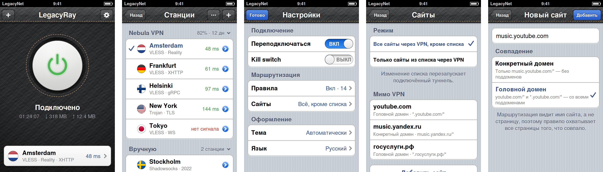
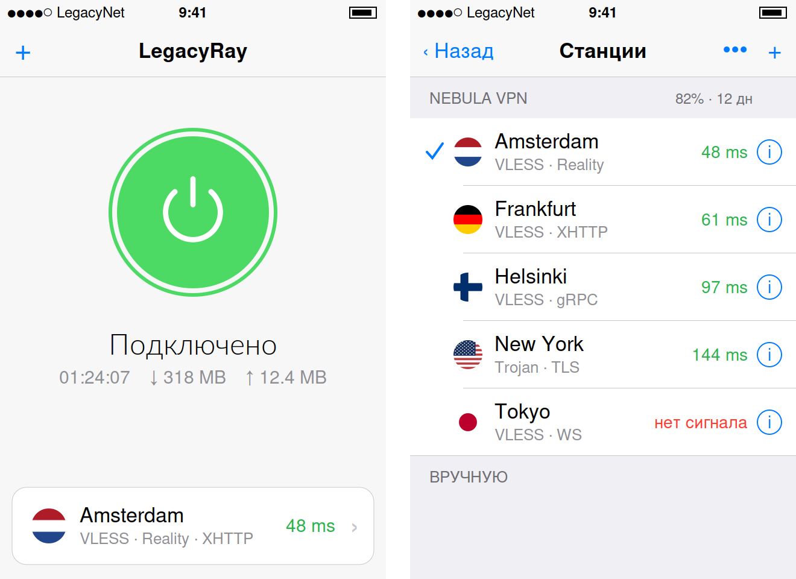
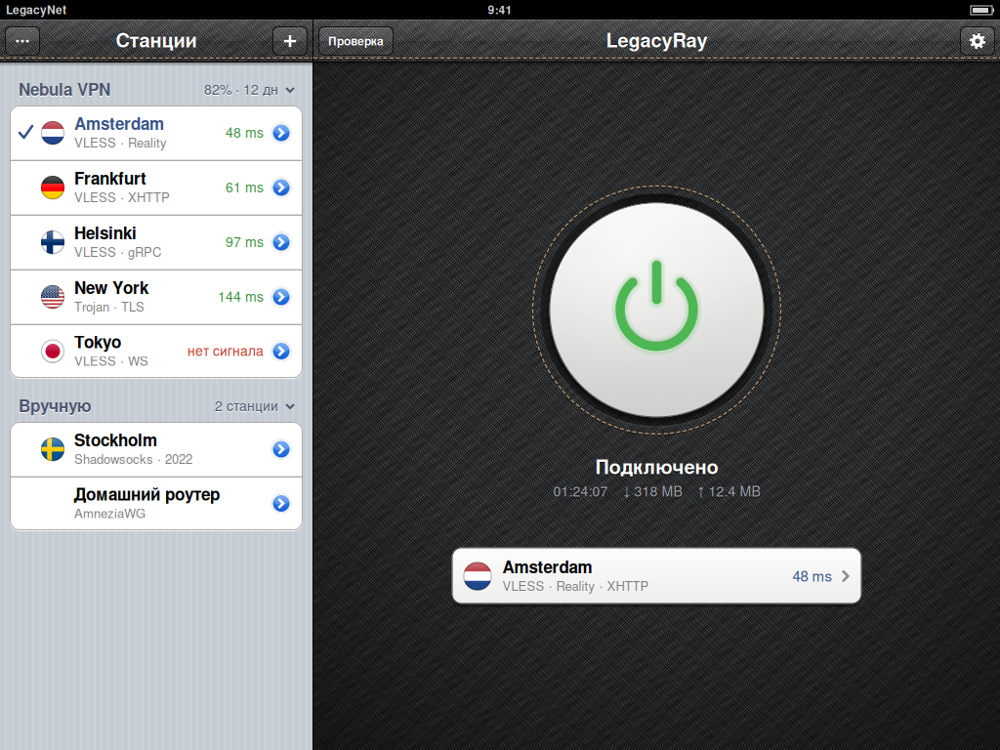

# LegacyRay

Клиент VLESS / Trojan / Shadowsocks / SOCKS / AmneziaWG / WireGuard для всего
устройства на **iOS 4.0 – 7.x** (джейлбрейк, armv7). На iOS 4–6 — интерфейс
в духе самих приложений Apple для iOS 6: панели из чёрного денима с медной
строчкой (как на иконке), одна большая кнопка и стандартные таблицы iOS 6;
на iOS 7 — родной плоский интерфейс iOS 7. Раскладка split view для iPad. Всё, что делают Happ и
Amnezia VPN и что возможно на этих системах, включая настройку своего
сервера по SSH. Особое внимание — батарее старых iPhone.

LegacyRay — форк [senko](https://github.com/sqmrak/senko) (sqmrak, GPL‑2.0):
сетевое ядро и демон взяты из senko и доработаны, интерфейс написан заново.
Набор функций повторяет [vless-core-app](https://github.com/notfence/vless-core-app)
(notfence), Happ и Amnezia VPN — **код оттуда не использовался**, только идеи.



> Картинки в `docs/` — рендеры прототипа отрисовки (`scripts/design`, Cairo),
> по которым делался CoreGraphics‑код. На устройстве детали могут отличаться.

## Батарея

Демон работает круглосуточно, поэтому он не должен просыпаться без дела.

| Что было (в senko) | Что стало |
|---|---|
| Главный цикл по очереди делал два `poll` по 50 мс — **~20 пробуждений в секунду** всегда, даже с выключенным VPN | Один `poll` на все сокеты с таймаутом до ближайшего реального события. На хосте: **200 → 1** вызов `poll` за 10 с простоя |
| Проверка смены сети (Wi‑Fi ↔ сотовая) — чтение интерфейсов каждые 2 с | Уведомления ядра через routing‑сокет; проверка только пока туннель поднят |
| DNS‑поток просыпался раз в секунду | Спит до запроса; чистка таблицы обхода — раз в 30 с и только если в ней что‑то есть |
| Статистика рассылалась раз в секунду всем подключениям | Только подписчику `WATCH` (приложению на экране), с арендой на 45 с |
| AmneziaWG: `poll` раз в секунду и новое рукопожатие **каждые 2 минуты даже без трафика** (будит сотовый модем) | Таймеры как в WireGuard: ключи обновляются, только когда идёт трафик; keepalive можно ограничить временем, пока включён экран |
| Приложение каждую секунду открывало новое соединение с демоном, а для AWG — **запускало setuid‑процесс каждую секунду** | Одно постоянное соединение (GCD) + Darwin‑уведомления; для AWG — чтение файла статуса |
| Главный экран с VU‑метрами и «дисплеем», которые перерисовывались каждую секунду | Одна кнопка и две строки текста; единственная анимация — медленная пульсация значка, пока идёт подключение |
| OpenSSL без ассемблера (`no-asm`), сервер выбирал AES‑GCM, которого нет в «железе» armv7 | OpenSSL с NEON‑ассемблером; в ClientHello ChaCha20 идёт первым (как у Chrome на процессорах без AES), и сервер выбирает его |
| Хук `connect()` писал строку в лог на каждое соединение в каждом приложении | Только в режиме отладки (Диагностика) |

## Оформление

| Тема | Что это |
|---|---|
| **Классическая** | iOS 6 так, как её сделала бы Apple: панели навигации из чёрного денима с медной строчкой, главный экран из того же денима с одной «жемчужной» кнопкой в прошитом гнезде (значок серый в покое, янтарный при подключении, зелёный, когда туннель поднят), под ней состояние и карточка станции; всё остальное — стандартные сгруппированные таблицы iOS 6 (полоски, белые ячейки, синие значения, переключатели ВКЛ/ВЫКЛ, синие кнопки ›), алерты и action sheet iOS 6 |
| **Плоская** | iOS 7: белые карточки, волосяные линии, синие текстовые кнопки, матовые полупрозрачные шапки, тонкие крупные цифры |
| **Автоматически** | плоская на iOS 7+, классическая на iOS 4–6 |

Иконка — ваш логотип (`art/logo.png` → `scripts/icon_from_logo.py` →
`art/icon-1024.png` → все размеры), из неё же взята текстура: тайл денима
(`denim.png`, `denim@2x.png`) сгенерирован бесшовным, для 1x и Retina — свой, без
муара. Экранных картинок в памяти нет: деним и полоски — узорные цвета,
освещение главного экрана — маленький градиент, растянутый по экрану.



**iOS 7 — родной режим.** Приложение собирается с SDK 6.1 (чтобы работать на
iOS 4), но в заголовке бинарника помечено как собранное под SDK 7.0
(`scripts/set_sdk_version.py`). Поэтому iOS 7 запускает его не в режиме
совместимости с iOS 6 (чёрная полоса статус‑бара), а как родное: интерфейс
под прозрачным статус‑баром, свайп «назад» от края, клавиатура и пружинные
анимации iOS 7, списки прокручиваются под матовой шапкой. Для iOS 7 — свои
плоские launch‑картинки. iOS 4–6 эту пометку не читают.

Всё, кроме тайла денима, рисуется кодом (CoreGraphics) и кэшируется;
одинаково чётко на обычных и Retina‑экранах.

### iPad



* Split view, как «Настройки» iOS 6 на iPad: станции слева (320 pt), главный
  экран справа — в обеих ориентациях.
* Настройки, детали, «Поделиться» — form sheet; меню — поповеры.
* На iOS 4 контейнер ведёт дочерние контроллеры вручную (containment API
  появился в iOS 5).

## Возможности

**Протоколы** (ядро senko): VLESS (TCP, TLS, Reality + xtls‑rprx‑vision,
WebSocket, XHTTP, gRPC), Trojan, Shadowsocks, SOCKS5/HTTP(S), AmneziaWG
1.0/1.5/2.0 и обычный WireGuard. Подписки: URI‑списки, base64, happ‑ссылки
(включая crypt5), Xray/sing‑box JSON, Clash YAML, Shadowrocket/Surge INI.

**Как в Happ**

| Функция | Где |
|---|---|
| Профили маршрутизации: `happ://routing/add/…` и `…/onadd/…`, JSON профиля, профиль из заголовка `routing` подписки (с вопросом «применить?») | Маршрутизация → Профили |
| `geosite:` и `geoip:` в правилах (`geosite:category-ru`, `geoip:ru`, `geosite:category-ads-all`…), пресет «Российские сайты напрямую» | Маршрутизация |
| Фрагментация TLS‑рукопожатия (размер, пауза) | Настройки → Обход блокировок |
| Поделиться станцией: QR‑код, ссылка, файл, почта | долгое нажатие на станцию |
| Подключиться к самой быстрой станции списка / всех | меню ••• и меню подписки |
| Напоминания за 3 дня и за день до окончания подписки | Настройки → Подписки |
| Информация подписки: трафик, срок, дата сброса, интервал обновления, веб‑страница, поддержка, анонс; сохранение своих названий; User‑Agent; версия Xray для Reality; HWID | подписка / Настройки |
| Типы пинга (TCP / рукопожатие / реальная задержка), сортировка, автообновление, обновление при открытии | Настройки |
| Раздача прокси в локальной сети (SOCKS5) | Настройки → Безопасность и сеть |
| Свой DNS‑сервер | там же |

**Как в Amnezia VPN**

| Функция | Где |
|---|---|
| **Свой сервер**: адрес VPS + пароль root или ключ → LegacyRay по SSH ставит Xray Reality (любой Linux с systemd) и/или AmneziaWG (Ubuntu), с проверкой отпечатка ключа сервера и живым журналом установки | меню «+» → «Настроить свой сервер», Настройки → Свои серверы |
| Управление сервером: состояние служб, клиенты (добавить → QR/ссылка/.conf, отозвать), перезапуск, удаление | Свои серверы → сервер |
| Несколько профилей AmneziaWG/WireGuard в списке станций, параметры обфускации (Jc, Jmin, Jmax, S1–S4, H1–H4, keepalive, MTU) с правкой по одному, проверка рукопожатия, экспорт `.conf`/QR | Станции → AmneziaWG |
| Импорт ключей `vpn://` и `.conf` | «+» |
| Раздельное туннелирование по сайтам: «всё, кроме списка» / «только список», импорт/экспорт списков Amnezia (JSON) и текстовых | Настройки → Сайты |
| Kill switch: пока туннель поднят, UDP (кроме DNS/NTP) не выходит мимо него | Настройки → Безопасность и сеть |

**Сайты: два режима.** Каждый сайт в списке раздельного туннелирования (и в
правилах маршрутизации) сопоставляется одним из двух способов:

| Режим | Что охватывает | Пример |
|---|---|---|
| **Конкретный домен** | только это имя, любые страницы | `xyz.abc.com` → `xyz.abc.com/*`; `abc.com` → `abc.com/*` (но не `www.abc.com`) |
| **Головной домен** | головной домен и все имена под ним | `abc.com` → `abc.com/*` и `*.abc.com/*`; `music.youtube.com` → `*.youtube.com/*` |

Головной домен вычисляется с учётом составных зон (`news.bbc.co.uk` →
`bbc.co.uk`, `site.com.ru`, `user.github.io`); `*.abc.com` берётся как есть.
Можно вставить ссылку целиком — останется имя; кириллические домены
(`госуслуги.рф`) переводятся в punycode и показываются обратно по‑русски.
Путь (`/*`) на выбор не влияет: маршрутизация видит имя сайта (DNS, SNI), а не
страницу, поэтому правило всегда охватывает все страницы. Режим сайта можно
поменять, нажав на него. Разбор — `app/Sources/Core/lr_site.c`, тесты —
`tests/test_site.c` (включая векторы RFC 3492 и сопоставление правилами демона).

**Как в vless-core-app** — всё из первой версии: сворачиваемые и
перетаскиваемые подписки, импорт (буфер, QR с фонариком и из «Фото», файл,
ручной ввод, Karing .zip и Karing LAN), режим «Инкогнито», проверка качества
соединения с детектором утечки, журнал действий, диагностический отчёт,
проверка обновлений через GitHub (TLS демона), FAQ; русский, английский,
китайский.

### Как трафик попадает в туннель

Демон пробует по очереди:

1. **pf** — если в системе есть `/dev/pf` и `pfctl` (iOS 7). Работает всё:
   правила по доменам и geo, geoip‑таблицы, kill switch, DNS через туннель.
2. **ipfw** — если есть `ipfw`. Весь TCP и DNS идут в туннель, блокировка
   по доменам и kill switch работают; «напрямую» — только локальные сети и
   правила по портам.
3. **хук `connect()`** из `legacyraytlsfix.dylib` (нужен MobileSubstrate) —
   когда нет ни pf, ни ipfw (обычно iOS 4–5). Перенаправляются приложения, в
   которые внедряется Substrate; правила по доменам здесь не действуют.

`pfctl`/`ipfw` в пакет не входят — они ставятся из репозиториев Cydia.
Тот же хук добавляет старым приложениям современные корневые сертификаты и
TLS 1.2/1.3 (Safari, Cydia).

## Сборка на Linux (Theos)

Нужно: Theos в `~/theos` с `sdks/iPhoneOS6.1.sdk`, `curl`, `perl`, `make`,
`python3` (+ `python3-cairo` для ресурсов).

```bash
make deps          # один раз: OpenSSL 3.5 (NEON), mbedTLS 3.6, libssh2 1.11 под armv7 / iOS 4.0
make package       # → packages/com.legacyray.app_1.0.0_iphoneos-arm.deb
make install THEOS_DEVICE_IP=192.168.1.10
```

Прочее: `make deps HOST=1` + `make test` — хост‑тесты (45 программ);
`make xcode` — пересоздать проект Xcode; `make resources` — иконки, launch‑
картинки, звуки; `python3 scripts/check_strings.py --missing` — непереведённые
строки. `scripts/build_deps.sh` сам правит ассемблер OpenSSL 3 для Mach‑O
(в OpenSSL 3 сломан вариант `ios32`: ссылка на `OPENSSL_armcap_P`).

Фреймворк Theos не работает с пробелами в пути, а проект лежит в
`~/Xcode Projects`, чтобы его видела VM: используются тулчейн и SDK из Theos,
`dm.pl` для пакета и свои Makefile (`make/config.mk`).

## Переход на Xcode 4.6.3 (OS X 10.8 в VM)

Папка `~/Xcode Projects` уже проброшена в VM (см. `~/Xcode Projects/_Setup/README.txt`).

1. На Linux один раз `make deps` — он кладёт OpenSSL и libssh2 в `deps/`.
2. Открыть `LegacyRay.xcodeproj`. Цели: **LegacyRay**, **legacyrayd**,
   **legacyrayctl**, **legacyray-kick**, **legacyrayawgd**, **legacyray-ssh**.
3. Подпись: в проекте `CODE_SIGNING_REQUIRED = NO`; если Xcode всё равно
   просит профиль — поставьте то же в `SDKSettings.plist` SDK 6.1. Фаза
   «Fakesign with ldid» подпишет бинарник, если `ldid` установлен, иначе —
   `ldid -S` на устройстве.
4. Фаза «Mark for iOS 7» делает ту же пометку SDK 7.0, что и Makefile.
5. Минимальная версия в Xcode — iOS 4.3 (ниже Xcode 4.6 не умеет); сборка
   Theos идёт до iOS 4.0. Твики и .deb собирает `make package`.

## Структура

```
app/            интерфейс (Objective-C, MRC)
  Sources/Core      клиент демона и поток WATCH, каталог, туннель, импорт, профили AWG и
                    маршрутизации, SSH-серверы, QR-кодер, напоминания, JSON (cJSON), локализация
  Sources/Skin      палитры тем и примитивы CoreGraphics
  Sources/Controls  кнопки iOS 6, большая кнопка, карточка станции, переключатель, алерты, меню,
                    тосты, сгруппированные ячейки, строки станций
  Sources/Screens   главный экран, станции, AWG, «Поделиться», маршрутизация/сайты/геобазы,
                    свои серверы, настройки, диагностика…
  Sources/iPad      контейнер iPad
  Resources         Info.plist, иконки, launch-картинки (iOS 4–6 и iOS 7), звуки, флаги,
                    server/lr-server.sh, лицензии
daemon/         legacyrayd, legacyrayctl, legacyray-kick, legacyrayawgd, legacyray-ssh (C)
tweaks/         legacyraytlsfix (TLS + хук connect), legacyraystatus (значок VPN)
layout/         содержимое пакета и DEBIAN-скрипты
tests/          хост-тесты
scripts/        зависимости, ресурсы, иконка из логотипа, локализация, генератор проекта Xcode,
                пометка SDK, прототип дизайна (scripts/design: classic.py и макеты)
art/            логотип и мастер иконки 1024×1024
```

Пути на устройстве: демон `/usr/bin/legacyrayd`, сокет `/var/tmp/legacyrayd.sock`,
конфиг `/var/root/Library/Preferences/legacyray.cfg`, лог
`/var/log/legacyray-system.log`, данные приложения (профили AWG, геобазы,
сохранённые серверы — файл с правами 0600)
`/var/mobile/Library/Preferences/LegacyRay/`.

## Состояние

Проверено здесь: демон, помощники, твики и приложение собираются под armv7 /
iOS 4.0 без ошибок (предупреждения — только об устаревших RSA‑функциях
OpenSSL 3 в `happ.c` из senko); все внешние символы есть в iOS ≤ 4.0 (поздние —
weak или через `respondsToSelector`/`dlsym`); хост‑тесты проходят — 46
программ, включая разбор сайтов и punycode, включая новые проверки geosite/geoip (на фикстурах и на настоящем
`dlc.dat`), фрагментации, kill switch, `WATCH`, ChaCha‑порядка, хранения
заголовка `routing` и круговой тест QR‑кодера через ZBar для версий 1–40.
Число пробуждений демона в простое измерено под `strace` на хосте.

**Не проверено на реальных устройствах и серверах** — у меня нет железа с
iOS 4–7 и VPS. В первую очередь стоит проверить:
* запуск демона через `legacyray-kick`, перехват трафика (pf на iOS 7, хук на iOS 4);
* новый классический дизайн на iOS 4–6: превью в `docs/` — рендеры прототипа
  на Cairo, а не снимки устройства (деним, переключатели, алерты и меню
  нарисованы кодом и на железе ни разу не запускались);
* родной режим iOS 7: отступы под статус‑баром, матовые шапки, iPad в обеих ориентациях;
* сборку OpenSSL с NEON‑ассемблером (правка `ios32` проверена по релокациям, но не запуском);
* «Свой сервер»: `legacyray-ssh` и `lr-server.sh` на чистом Ubuntu/Debian VPS
  (скрипт проверен `bash -n` и на примерах конфигов, не на живом сервере);
* AmneziaWG с новыми таймерами (ленивое рукопожатие, keepalive по экрану).

Ограничения: OpenVPN, IKEv2 и Cloak (есть в Amnezia) не поддерживаются;
Hysteria2 тоже; правила применяются по приоритету Block > Direct > Proxy, а не
по порядку; geosite берётся из компактного `dlc.dat` (сборки на 70 МБ старым
телефонам не по силам), категории `regexp:` пропускаются.

## Лицензия

GPL‑2.0 (как у senko), см. `LICENSE`. Сторонние компоненты — в
`app/Resources/THIRD_PARTY_LICENSES.txt`: OpenSSL, Mbed TLS (Apache 2.0),
libssh2 (BSD‑3), ZBar (LGPL‑2.1), cJSON (MIT), fishhook (BSD), корневые
сертификаты Mozilla (MPL 2.0). Геоданные (v2fly domain-list-community,
ipverse) не входят в пакет — скачиваются по запросу.
